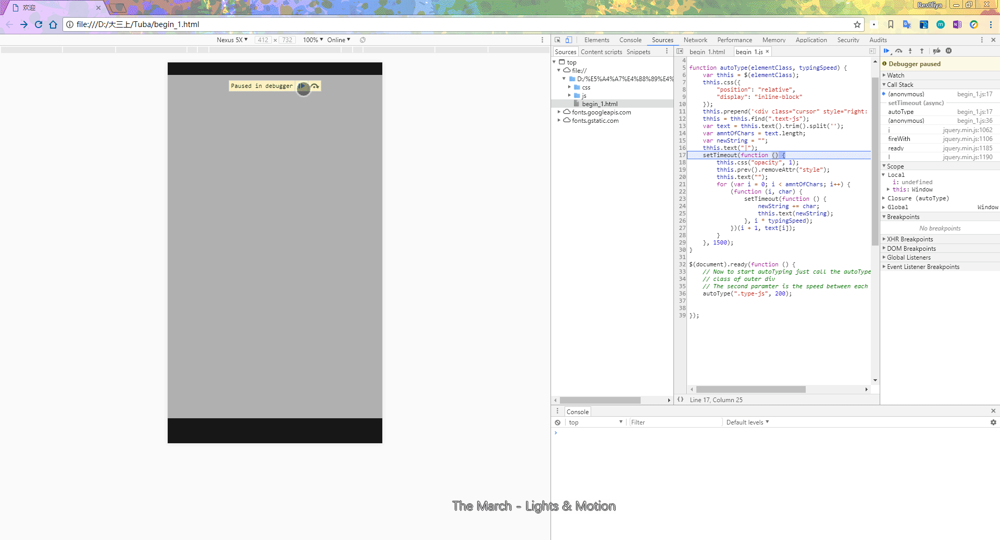
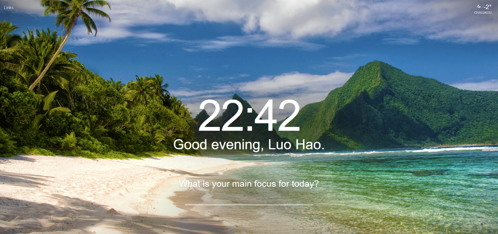

# Tuba

变秃吧变秃吧——计软科协的前端
**好吧，现在开始后端也要自己写了**
撸是不可能自己撸了
还是得自己撸啊...

## 11月30日的结果

## 12月6日的结果

嗯。。没结果

## 12月17的结果

恩。。。今天是ddl 

突然提前就是很难过的一件事情了 

真的糟心 

## 几个地方——制作后

1. begin_2(素质九连)需要去掉工具栏 

2. **按钮有点丑可能要改一下**

整个界面的**美化**——Button——根据找到的demo修改一下 

3. **有些是绝对布局，可能有些手机尺寸不太适合**

**结果界面*5**的绝对布局还要修改，改成百分比 

4. **网站的发布和服务器**

5. 整个静态的，动画大概是没机会了

## 一点思路——制作前和制作中

1. 首先进入的时候：一条微信消/一个电话/**一个动态字√**

2. 然后**素质九连**——跳转到答题页面

3. 进入主界面，主界面：表情包+文字（**图片化**）+**动画效果**

4. 问题界面：同主界面应该就够了

5. 结束界面：同主界面——分为五个级别，分不同的结果

6. 结束之后的彩蛋：**来计软迎新晚会吧**

7. 效果性：**头发的数量可以float**

<!-- ## MAKA iH5 百度H5
可视化h5暂时只考虑这三个吧

## 麦克
微信表单提交试试这个 -->

## 范围界定

### 90以上 长发及腰

### 70-90 浓密

### 40-70 头发逐渐消失

### 10-40 地中海

### 10以下  聪明绝顶

